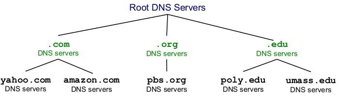

# Réseaux

## 

### Application

- Exemples : vie de tous les jours
    - e-mail (voir tp 3)
    - web 
    - jeux 
    - streaming
- Termes techniques 
    - URI $\Rightarrow$ Uniform Resource Identifier
    - URL $\Rightarrow$ Uniform Resource Locator 
        - Composed of URI's
- Principes des applications réseaux
    - communique par network
    - Client process : init communication
    - Server process : wait for communication
    - Socket 
        - interface entre OS et network stack (Transport, Network, ...)
        - choix de protocole de transport (TCP, UDP)
        - Socket programming (tp)
    - Adressing remote process $\Rightarrow$ IP adress + Port number
    - Potential Requirements (motivate choice TCP or UDP)
        - Reliable data transfer
        - Timing
        - Debit
        - Security

- Protocols
    - Hyper Text Transfer Protocol (Secure) $\Rightarrow$ HTTP(S)
        - Uses URL to 
            - Address Objects
            - Send parameters (ex : "search=lorem", ...)
        - Stateless $\Rightarrow$ Server maintains no info about past clients
        - Client-Server model
        - Uses TCP (important order below)
            - Server listens TCP connections
            - Client initiates TCP connection to Server
            - Server Accepts
            - Client sends HTTP request
            - Server sends HTTP response
            - TCP closes
        - Messages
            - ASCII Encoding
            - 2 types 
                - request
                    - Methods (most important ones)
                        - `GET` $\Rightarrow$ retrieve object from Server
                        - `HEAD` $\Rightarrow$ `GET` for debugging, only headers
                        - `POST` $\Rightarrow$ send object to server
                - response 
                    - Status codes ("X" means 1 digit)
                        - 1XX $\Rightarrow$ Info
                        - 2XX $\Rightarrow$ Success
                        - 3XX $\Rightarrow$ Redirection
                        - 4XX $\Rightarrow$ Client Error (ex : 404)
                        - 5XX $\Rightarrow$ Server Error
            - End delimiter 
                - Content-length header $\Rightarrow$ know where to stop
                - Close connection (when data is transmitted)
                - Transfer-encoding : chunked header $\Rightarrow$ message split in chunks with length + content
                - Implicit length $\Rightarrow$ responses without content, usually error msgs
        - Performances 
            - Def RTT : Round Trip Time $\Rightarrow$ temps pour aller-retour client-server
            - $T$ = time to transmit file
            - Non-persistent HTTP (HTTP/1.0 default behavior)
                - 1 object / TCP connection 
                - 
                - $t = \sum (2 \cdot RTT + T_i)$
            - Persistent HTTP (HTTP/1.1 default behavior)
                - several objects / TCP connection
                - 
                - $t = RTT + \sum (RTT + T_i)$
                - better with pipelining 
                    - 
                    - $t = 2 \cdot RTT + \sum T_i$

        - Cookies $\Rightarrow$ Keep state identification
        - Proxy Server / Web Cache
            - Installed by local ISP
            - Acts as Client & Server
            - Browser forced to access Proxy 
            - Proxy works as an OS cache
                - if object in cache : response to Client
                - else : request to origin Server
            - Avoid request to Server 
                - Objective : reduce RTT
                - Solution : optional expiration date in header
            - Avoid full response to Client
                - Objective : reduce bandwidth usage
                - Solution : conditional GET $\Rightarrow$ If-modified-since <date>
        - HTTP/2.0 
            - Multiplexes concurrent requests in 1 TCP connection
            - Reduces headers $\Rightarrow$ Binary Encoding
            - Supports Server Push
                - If 1 pushed object requires other objects $\Rightarrow$ Push Promise
                - Ex : `index.html` pushed and requires `style.css`, `script.js`, ...

    - Domain Name System $\Rightarrow$ DNS
        - Resource Records (also RR)
            - = entry in DNS database
            - Format : domain name, value, type, TTL (time-to-live)
            - Allows future evolution
        - Each Server maintains cache
        - Local Name Server 
            - Each local ISP has at least one
            - $\approx$ Proxy
        - Top-Level Domains $\Rightarrow$ TLD
            - edu 
            - org 
            - ...
        - Map : IP adress $\Leftrightarrow$ Hostname
            - Hostname $\Rightarrow$ IP adress : Name Resolution
                - Recursive Name Resolution
                    - 
                - Iterative Name Resolution
                    - 
            - IP address $\Rightarrow$ Hostname : Reverse Lookup
                    
        - Servers and Structure
            - 
        - DNS tool $\Rightarrow$ `dig` (tp)

### Transport

- Termes techniques
    - Port number 
        - identifies process communication end point (HTTP, ...)
        - Used by Transport Protocols

    - Checksum
        - let $n_i$ the components of a segment 
        - the segment keeps $CS = \neg \sum n_i \Rightarrow CS + \sum n_i =$ only 1's
        - so can tell if corrupted bit

- Reliable data transfer Principles
    

- Protocols 
    - Unavailable Services 
        - delay guarantees
        - bandwidth guarantees
    - De/Multiplexing $\Rightarrow$ by header
    - Transmission Control Protocol $\Rightarrow$ TCP 
        - \+
            - connection-oriented $\Rightarrow$ setup required client-server processes
            - reliable data transfer
            - flow control $\Rightarrow$ no overwhelming to receiver
            - congestion control $\Rightarrow$ limit sender if network overload
        - \- 
            - no timing
            - no minimum debit
            - no security
            - heavy

        - Multiplexing : `header = (srcIP, dstIP, srcPort, dstPort)`
        
        - mnemo : Tu Communique Précautionneusement

    - User Datagram Protocol $\Rightarrow$ UDP
        - connectionless $\Rightarrow$ no handshake
        - uses Checksum
        - \+ 
            - fast (ex : no handshake)
        - \- 
            - unreliable data transfer
        - why if tcp exists ? video games, streaming $\Rightarrow$ when time is more important

        - Multiplexing : `header = (dstIP, dstPort)`

        - mnemo : Ultra Direct Pratique
        

### Network

- Protocols
    - Internet Protocol $\Rightarrow$ IP
        - IP Adress $\Rightarrow$ identifies host device
            - ex : gaia.cs.umass.edu $\Rightarrow$ 128.119.245.12
    
- Network Core :
        - Network Structure
        - ISP : Internet Service Provider (Fournisseur d'accès internet)
        - Tier 1,2,3/local $\Rightarrow$ chaque tier paye au-dessus (tier 3 = Proximus, local can be univ, etc)

### Link
- Comment transférer data ?
    - Circuit Switching : Réservation d'un circuit pour transférer
        - Resources : link bandwidth + switch capacity (not ability)
        - Ressources dédiée / 1 circuit $\Rightarrow$ perf++
        - Multiplexing
            - Frequency Division Multiplexing (FDM)
                - 
                - Comment ? Signal porteur $f_c$
            - Time Division Multiplexing (TDM)
                - 
                - Comment ? RR-like algo
            - $R_{new} = \frac{R}{N}$
    - Packet Switching : division data en packets
        - 1 lien / packet
        - delay 
            - variables 
                - $L$ packet length (bits b)
                - $R$ link bandwidth (b/s)
                - $d$ physical link length (m)
                - $s$ propagation speed (m/s)
            - formules et données
                - $t_{trans} = \frac{L}{R}$ (transmission delay)
                - $t_{propa} = \frac{d}{s}$ (propagation delay)
                - $t_{proc}$ (processing delay, often negligible)
                - $t_{queue}$ (queuing delay)
                - $t_{nodal} = t_{trans} + t_{propa} + t_{proc} + t_{queue}$
        - queueing
            - M/M/1 queueing model (theorical)
                - M/M/1 $\Rightarrow$ Markovian x 2, 1 infinite q
                - $\lambda$ avg pkt **arrival** rate (pkts/s)
                - $\mu$ avg pkt **departure** rate (pkts/s)
                - $\rho = \frac{\lambda}{\mu}$ intensity (stable if < 1, 'inf' delay else)
                - $\overline{N} = \rho (1 - \rho)$ avg nbr of pkts in q
            - delay depends on pkt arrival $\Rightarrow$ exos
            - packet loss (q has finite capacity)
        - debit : $R \leq min(R_i) \Rightarrow$ bottleneck 
        - store and forward $\Rightarrow$ long transmission delay
            - solution : 
            - $d_{trans} = (\sum \frac{L}{R_i}) + (N - 1) \frac{L}{R_{min}}$
        - packet max size (bc pipelining)
            - msg size = $M$ bits
            - header size = $H$ bits
            - max packet size = $K_{max}$ bits
            - Number of bits to transmit = $M + H \lceil \frac{M}{K_{max}} \rceil$
            - Time $T$ 
                - without pipelining : $T = N (\frac{H + M}{R})$
                - with pipelining : $T = \frac{1}{R} ((N - 1) K_{max} + M + H \lceil \frac{M}{K_{max}} \rceil)$ où N is nbr of links
            - Average number of packets = $\frac{\overline{M}}{K_{max}} + \frac{1}{2}$
            - $\overline{T} = \frac{1}{R} ((N - 1) K_{max} + \overline{M} + H (\frac{\overline{M}}{K_{max}} + \frac{1}{2}))$
            - $K_{max} \approx \sqrt{\overline{M} \frac{H}{N - 1}}$

### Physical

- Termes techniques
    - Modem : modulateur - démodulateur de signaux (analogique $\Leftrightarrow$ digital)
    - Baseband : Données à transmettre, fréquence notée $f_b$
    - Carrier signal / Signal porteur : Signal servant à transporter des données, fréquence notée $f_c$
    - Passband / Bande passante : Signal modulé à partir de Baseband et Carrier signal, avec $f_b$ <<< $f_c$

- Modulations Digitales
    - M : nombre de symboles (QPSK, QAM)
    - N : nombre de bits encodés par symbole, $N = log_2(M)$
    - Symbol / Baud rate : $R_s = \frac{1}{T_s}$
    - Bit rate : $R = \frac{N}{T_s} = N R_s$
    - 
    - 
    - QAM 
    - plus efficace (avec noise) : PSK, QPSK

- Transmission impairments
    - Limited Bandwidth :
        - $f$ max imposée $\Rightarrow$ déformation signal
        - 
    - Attenuation (with distance)
        - $P_{tx}$ et $P_{rx}$, resp. puissance des signaux transmis et reçus
        - $Attenuation = \frac{P_{tx}}{P_{rx}}$
        - $Attenuation_{dB} = 10 log_{10}(\frac{P_{tx}}{P_{rx}})$
    - Delay distortion 
        - 
    - Noise (Bruit)
        - Origines
            - Thermal noise : mvmt électrons
            - Intermodulation : interférence avec modulateurs alentours (gérable easy)
            - Impulse noise
        - Signal-to-Noise Ratio, $SNR = \frac{S}{N}$ où S, N puissance resp. du signal et du noise
        - SNR++ $\Rightarrow$ perf++
        - impact QPSK
            - 

- Theorical channel capacity
    - Noise free channel 
        - $R = 2B$ (où B est la Bandwidth)
        - $C = 2B log_2(M)$ (général)
    - Noisy channel
        - $C = B log_2(1 + \frac{S}{N})$

## Protocols

- Ensemble de règles permettant de communiquer (syntaxes, type de msg, ...)
- Encoding 
    - Should follow 
        - Space Efficiency 
        - Ease of Delimiting
        - Ease of Parsing (trad msg)
        - Data Transparency (must have the ability to carry **anything**)

    - Examples 
        - Binary Encoding 
            - fixed group of bits for msg fields
            - 
            - compact++
            - flexible-
            - ex : DNS, HTTP/2.0, TCP, UDP, IP, Ethernet 
        - Type-Length-Value (TLV) Encoding
            - 
            - compact+
            - flexible-
            - ex : IP, TCP, (DHCP), ... 
        - Match Tag (ASCII Encoding)
            - Just text with delims
            - 
            - compact-
            - flexible++
            - ex : HTTP/1.1 headers, ...

