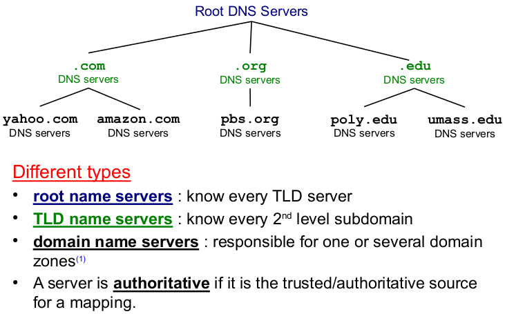
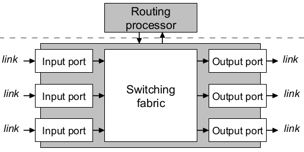

## 

### Application

- Exemples : vie de tous les jours
    - e-mail (voir tp 3)
    - web 
    - jeux 
    - streaming
- Termes techniques 
    - URI $\Rightarrow$ Uniform Resource Identifier
    - URL $\Rightarrow$ Uniform Resource Locator 
        - Composed of URI's
- Principes des applications réseaux
    - Client-Server model
        - Server process : **wait** for communication
        - Client process : **initiates** communication 
    - Socket 
        - interface OS/network stack (Transport, Network, ...)
        - choix de protocole de transport (TCP, UDP)
        - Socket programming (tp)
    - Adressing remote process
        - IP adress + Port number
    - Potential Requirements (motivate choice TCP or UDP)
        - ex: reliable data transfer, timing, security, debit, ...

- Protocols
    - Hyper Text Transfer Protocol (Secure) $\Rightarrow$ HTTP(S)
        - Uses URL to 
            - Address Objects
            - Send parameters (ex : "search=lorem", ...)
        - Stateless 
            - Server maintains no info about past clients
        - Client-Server model
        - Uses TCP (important order)
            - Server listens TCP connections
            - Client initiates TCP connection to Server
            - Server Accepts
            - Client sends HTTP request
            - Server sends HTTP response
            - TCP closes
        - Messages
            - ASCII Encoding
            - 2 types 
                - request
                    - Methods (most important ones)
                        - `GET` $\Rightarrow$ retrieve object from Server
                        - `HEAD` $\Rightarrow$ `GET` for debugging, only headers
                        - `POST` $\Rightarrow$ send object to server
                        - `PUT`, `DELETE`, ...
                - response 
                    - Status codes ("X" means 1 digit)
                        - 1XX $\Rightarrow$ Info
                        - 2XX $\Rightarrow$ Success
                        - 3XX $\Rightarrow$ Redirection
                        - 4XX $\Rightarrow$ Client Error (ex : 404)
                        - 5XX $\Rightarrow$ Server Error
            - End delimiter 
                - Content-length header $\Rightarrow$ know where to stop
                - Close connection (when data is transmitted)
                - Transfer-encoding : chunked header $\Rightarrow$ message split in chunks with length + content
                - Implicit length $\Rightarrow$ responses without content, usually error msgs
        - Performances 
            - Def RTT : Round Trip Time $\Rightarrow$ temps pour aller-retour client-server
            - $T$ = time to transmit file
            - Non-persistent HTTP (HTTP/1.0 default behavior)
                - 1 object / TCP connection 
                - 
                - $t = \sum (2 \cdot RTT + T_i)$
            - Persistent HTTP (HTTP/1.1 default behavior)
                - several objects / TCP connection
                - 
                - $t = RTT + \sum (RTT + T_i)$
                - better with pipelining 
                    - 
                    - $t = 2 \cdot RTT + \sum T_i$

        - Cookies 
            - Keep state identification
                - How ? ID in HTTP request/response (+ database)
        - Proxy Server / Web Cache
            - Installed by local ISP
            - Acts as Client & Server
            - Browser forced to access Proxy 
            - Proxy works as an OS cache
                - if object in cache and not modified since <last date> : response to Client
                - else : request to origin Server
            - Avoid request to Server 
                - Objective : reduce RTT
                - Solution : optional expiration date in header
            - Avoid full response to Client
                - Objective : reduce bandwidth usage
                - Solution : conditional GET $\Rightarrow$ If-modified-since <date>
        - HTTP/2.0 
            - Multiplex concurrent requests in 1 TCP connection + resource prioritization
                - 
            - Compress headers $\Rightarrow$ Binary Encoding
            - Supports Server Push
                - If 1 pushed object requires other objects $\Rightarrow$ Push Promise
                - Ex : `index.html` pushed and requires `style.css`, `script.js`, ...

    - Simple Mail Transfer Protocol $\Rightarrow$ SMTP 
        - Uses TCP
        - Commands ($\approx$ requests) in ASCII
        - Responses : status code + phrase
        - Transfer 
            - Handshake 
            - Message transfer 
            - Closure
        - Mail access protocols 
            - 
            - Post Office Protocol $\Rightarrow$ POP 
                - POP3 tp
            - Internet Mail Access Protocol $\Rightarrow$ IMAP
            - HTTP

    - Domain Name System $\Rightarrow$ DNS
        - Servers and Structure
            - 
            - Exists because a centralized DNS is bad 
                - Single point of failure 
                - Traffic Volume 
                - Distant from everything,
                - ...
            - Top-Level Domains $\Rightarrow$ TLD
                - com
                - edu 
                - org 
                - ...
        - Resource Records (also RR)
            - = entry in DNS database
            - Format : domain name, value, type, TTL (time-to-live)
            - Allows future evolution
        - Each Server maintains cache
        - Local Name Server 
            - Each local ISP has at least one
            - $\approx$ Proxy
        - Map : IP adress $\Leftrightarrow$ Hostname
            - Hostname $\Rightarrow$ IP adress : Name Resolution
                - Recursive Name Resolution
                    - 
                - Iterative Name Resolution
                    - 
            - IP address $\Rightarrow$ Hostname : Reverse Lookup
                - IP addresses translated to string and searched (from end always)
                    
        - DNS tool $\Rightarrow$ `dig` (tp)

### Transport

- Termes techniques
    - Port number 
        - identifies process communication end point (HTTP, ...)
        - Used by Transport Protocols

    - Checksum
        - let $n_i$ the components of a segment 
        - the segment keeps $CS = \neg \sum n_i \Rightarrow CS + \sum n_i =$ only 1's
        - so can tell if corrupted bit
    
- Reliable Data Transfer (RDT) Principles
    - try to understand / redo some state machines $\Rightarrow$ potential exam question
    - Assumptions
        - Everything works fine $\Rightarrow$ RDT1.0
            - Ideal (not realistic) data transfer 
        - Bits may flip $\Rightarrow$ RDT2.0
            - Receiver verify msgs with Checksum and send : 
                - ACK(nowlegments) $\Rightarrow$ pkt OK
                - NAK (Negative AcK) $\Rightarrow$ pkt corrupted
            - 
        - ACK / NAK may be corrupted $\Rightarrow$ RDT2.1
            - Alterning sequence number 0, 1 to recognize duplicates (only 2 bc stop & wait)
            - Checksum on ACK / NAK too
            - 
        - NAK-free $\Rightarrow$ RDT2.2
            - Always ACK the sequence number
            - 
        - Pkt loss may happen $\Rightarrow$ RDT3.0
            - timeout for ACK's
            - 
            - base perf stinks $\Rightarrow$ solution :
                - sequence number : 0 $\rightarrow$ n
                - pipelining : 2 ways 
                    - Go-Back-N
                        - discard out of order pkts if pkt loss
                            - 
                        - ACK loss but sequence number $\nearrow \  \Rightarrow$ Sender knows Receiver ACK'd 
                            - 
                        
                    - Selective repeat
                        - just timeout for pkt / ACK loss
                            - 
                            - 
                            
                        - but problem : cyclic number can be misinterpreted
                            - 
                            - solution $\Rightarrow 2^M \geq 2N$ (bc worst case is Receiver one window in advance of Sender)

- Protocols 
    - Transmission Control Protocol $\Rightarrow$ TCP 
        - Segment structure
            - Maximum Segment Size $\Rightarrow$ MSS 
                - restrained by MTU (Maximum Transmission Unit)
                    - 
                - MSS Trade-off
                    - if MSS too large $\Rightarrow$ fragmentation (IP datagrams might be too large for certain links)
                    - if MSS too low $\Rightarrow$ too much TCP/IP header overhead
                - MSS negotiation 
                    - TCP can announce MSS to incoming TCP segments to readjust
                - Nagle's algo 
                    - solution for small-pkt problem (small msgs apps)
                    - functioning
                        - if no coming ACK : send immediately 
                        - else : send when 
                            - previous pkt is ACK'd 
                            - segment size reached MSS
            - Content 
                - source port nbr 
                - dest port nbr 
                - sequence nbr 
                - ACK nbr 
                - flags (ACK, etc)
                - checksum 
                - options (SACK, MSS, etc)
                - receive windown `rwnd` (flow control)
                - ...
        - Reliable data transfer 
            - Retransmission TimeOut $\Rightarrow$ RTO 
                - Depends of RTT $\Rightarrow$ need to constantly estimate RTT
                    - $R_i$ = time between seg transmission and its ACK
                    - Smoothed RTT $\Rightarrow SRTT$
                    - Exponentially Weighted Moving Average $\Rightarrow$ EWMA
                        - weight $\Rightarrow \alpha$ ( = 0.125 usually)
                        - inductive form 
                            - $SRTT_0 = R_0$
                            - $SRTT_i = (1 - \alpha) SRTT_{i-1} + \alpha R_i$
                        - general form (ok to retrieve from inductive)
                            - $SRTT_i = \sum_{k=0}^i \alpha (1 - \alpha)^{i - k} R_k = \alpha \sum_{k=0}^i (1 - \alpha)^{i - k} R_k$
                        - not enough to follow RTT !
                    - Safety margin 
                        - weight $\Rightarrow \beta$ ( = 0.25 usually)
                        - inductive form 
                            - $DevRTT_0 = R_0 / 2$
                            - $DevRTT_i = (1 - \beta) DevRTT_{i - 1} + \beta | SRTT_i - R_i |$
                        - general form (as ok as SRTT)
                            - $DevRTT_i = \sum_{k = 0}^i \beta (1 - \beta)^{i - k} |SRTT_k - R_k| = \beta \sum_{k = 0}^i (1 - \beta)^{i - k} |SRTT_k - R_k|$
                    - $RT0_i = SRTT_i + 4 DevRTT_i$
                        - if timer expires, $RTO \leftarrow 2 RTO$
            - Fast retransmit
                - 
                - Detect lost segments via duplicates (3) ACKs
                - Directly resend 
        - Flow control
            - Matches sender speed and receiver drain
            - How ? receive window `rwnd` var sent by receiver
                - if `rwnd = 0` : stop sending
                - if `rwnd > 0` : send `rwnd` segment
                - sender might not receive `rwnd` info
                    - send window probe (= sonde) every *persist timer* time
            - Silly Window Syndrome 
                - Risk of slowing down a lot 
                - Ex : `rwnd = 1` and 1 byte to be sent constantly
                - Solutions 
                    - Avoid annoucing `rwnd < MSS` (receiver part)
                    - OR
                    - Avoid sendind too small segments (sender part) $\Rightarrow$ Nagle's algo
            - $Throughput \approx \frac{rwnd}{RTT}$
            - Options to scale `rwnd` to `rwnd`$\cdot 2^N$
        - Connection Managment 
            - 3-way handshake
                - 
            - closing 
                - 
            - TCP connection management state machine 
                - 
        - Congestion Control
            - To avoid to overwhelm the network (routers, link, ...) (!= flow ctrl)
            - let `cwnd` adapting var for congestion window
                - Slow Start
                    - `cwnd = 1*MSS`
                    - `cwnd += nbr_ACK*MSS` **every RTT** (exponential)
                - Additive Increase, Multiplicative Decrease (AIMD)
                    - let `ssthresh` slow start threshold(=seuil)
                        - at beginning : set to large value
                        - after loss : `ssthresh = cwnd / 2`
                    - AIMD activates when `cwnd >= ssthresh` $\Rightarrow$ Congestion avoidance
                    - `cwnd += 1*MSS` **every RTT**
                    - if loss (detected by 3 dup ACKs) $\Rightarrow$ Fast recovery
                        - `cwnd = ssthresh = cwnd / 2`
                    - if timeout (no ACK for too long = congestion) 
                        - `ssthresh = cwnd / 2`
                        - `cwnd = 1*MSS` (Slow start again)
                    - Throughput (congestion avoidance)
                        - 
        - Selective ACK (SACK)
            - reduces retransmission duplicates
            - ex 
                - pkts sent : 1 2 3 4 5 6 7 but 3 4 lost ! 
                - Receiver sends ACK(2) AND SACK 5-7
                - Sender retransmits 3 4 instead of 3-7
        - Fair due to AIMD
    - User Datagram Protocol $\Rightarrow$ UDP
        - connectionless $\Rightarrow$ no handshake
        - uses Checksum
        - \+ 
            - fast (ex : no handshake)
        - \- 
            - unreliable data transfer
        - why if tcp exists ? video games, streaming $\Rightarrow$ when time is more important

### Network

- Protocols
    - Internet Protocol $\Rightarrow$ IP
        - Format 
            - insert img (dont know yet)
            - Fragmentation 
                - flags in header 
                    - Don't Fragment $\Rightarrow$ DF 
                    - More Fragment $\Rightarrow$ MF 
                    - unused
                - for exercises, remember IP header = TCP header = 20B
        - Addressing
            - Classful addressing
                - 
            - Subnetting 
                - \>\< Classful addressing 
                - idea : take an IP address and share it
                - prefix-length (bc no class)
                    - distinguish net and host 
                    - ex : `171.18.32.36/19`
                        - `mask = 255.255.224.0`
                        - `net = 171.18.32.0`
                        - `host = 0.0.0.36`
                - Formules 
                    - `net = addr & mask`
                    - `host = addr & !mask`
                    - `(other_addr & mask) == (addr & mask)` (to see if `addr` and `other_addr` are in the same subnet)
                    - `(other_addr ^ addr) & mask == 0` (same)
                - the subnet is made in the host part
                - when subnetting, the host part can't have 
                    - the lowest addr $\Rightarrow$ network addr
                    - the highest addr $\Rightarrow$ broadcast
                    - doesnt apply for links since smart routers on ends
        - Forwarding
            - Forwarding table
                - 
            - Longest Prefix Matching (LPM) (self exp)
                - Software Implementation with b-tree (trie)
                    - bit = 0 $\Rightarrow$ Left
                    - bit = 1 $\Rightarrow$ Right
                    - 
                - Hardware Implementation with Ternary Content-Addressable Memory (TCAM)
                    - 
                    - Ternary
                        - 0, 1 or x (might be both)
                    - Content-Adressable Memory 
                        - Search to all entries in parallel $\Rightarrow$ perf++
        - How to get IP address ?
            - networks 
                - 
                - bottom network gets allocated addr space from above
                - easier forward IP addr (unless user changes IPS for example)
            - users 
                - static config 
                    - by network admin
                    - OS can handle
                - dynamic congig 
                    - link-local addresses
                        - automatic random addr given
                    - DHCP (best)
        - Network Address Translation $\Rightarrow$ NAT
            - Map network (green) and local (red) IP addresses 
                - 
            - Problem 
                - the local address isnt visible externally
                - Solutions but controversial
                    - violates end-to-end
                    - break some application layer protocols
        - IPv6
            - motivation 
                - ipv4 almost completely allocated 
                - perf++
            - how to transition ? 
                - Tunneling 
                    - 
                    

    - Dynamic Host Configuration Protocol $\Rightarrow$ DHCP
        - allows host to dynamically optain IP address
        - uses UDP
        - functioning 
            - client asks for IP addr to servers
                - 
            - 3 timers starts if connected : `T1 < T2 < Lease`
                - `T1 expires` $\Rightarrow$ request to same server
                - `T2 expires` $\Rightarrow$ request all accessible servers ('needs help' bc its serv left it)
                - `Lease expires` $\Rightarrow$ deconnection
        - can use relays
        - relies a lot on options encoded in TLV

    - Internet Control Message Protocol $\Rightarrow$ ICMP 
        - error / reachability reporting
        - multiple pkts sent with TTL = 1,2,3,... until dst reached
        - 
        - can also discover MTU and notice src

- Router Architecture 
    - 
    - Switching fabrics 
        - Memory (1st gen)
            - Architecture like computers 
            - pkts copied to memory 
            - CPU controls switching
        - Bus (2nd gen)
            - Fwding cache / line + CPU $\Rightarrow$ faster
            - 
        - Crossbar (3rd gen)
            - 
            - can be difficult to addess $N \times M$ points
    - Head-Of-Line (HOL) blocking 
        - 
        - solution $\Rightarrow$ split input into queues for != outputs
                
- Routing algorithms 
    - Link State Routing Protocol
        - Link State Packet (LSP) Flooding
            - Each router sends neighbors / costs to its neighbors with LSPs
        
    - Distance Vector Protocol (voir projet)

- Switching 
    - Def : defines how a network element forwards data with its header
    - Circuit Switching or Packet Switching

    
- Network Structure
    - ISP : Internet Service Provider (Fournisseur d'accès internet)
    - Tier 1,2,3/local $\Rightarrow$ chaque tier paye au-dessus (tier 3 = Proximus, local can be univ, etc)

### Link
- Comment transférer data ?
    - Circuit Switching : Réservation d'un circuit pour transférer
        - Resources : link bandwidth + switch capacity (not ability)
        - Ressources dédiée / 1 circuit $\Rightarrow$ perf++
        - Multiplexing
            - Share 1 link among N circuits
                - Frequency Division Multiplexing (FDM)
                    - 
                    - Comment ? Signal porteur $f_c$
                - Time Division Multiplexing (TDM)
                    - 
                    - Comment ? RR-like algo
                - $R_{new} = \frac{R}{N}$
    - Packet Switching : division data en packets
        - 1 lien / packet
        - delay 
            - variables 
                - $L$ packet length (bits b)
                - $R$ link bandwidth (b/s)
                - $d$ physical link length (m)
                - $s$ propagation speed (m/s)
            - formules et données
                - $d_{trans} = \frac{L}{R}$ (transmission delay)
                - $d_{propa} = \frac{d}{s}$ (propagation delay)
                - $d_{proc}$ (processing delay, often negligible)
                - $d_{queue}$ (queuing delay)
                - $d_{nodal} = d_{trans} + d_{propa} + d_{proc} + d_{queue}$
        - debit : $R \leq min(R_i) \Rightarrow$ bottleneck 
        - store and forward $\Rightarrow$ long transmission delay
            - solution : pipelining 
                - 
                - $d_{trans} = (\sum \frac{L}{R_i}) + (N - 1) \frac{L}{R_{min}}$
                - packet max size
                    - msg size = $M$ bits
                    - header size = $H$ bits
                    - max packet size = $K_{max}$ bits
                    - number of packets: $n = \lceil \frac{M}{K_{max}} \rceil$
                    - Number of bits to transmit = $M + H n$
                    - N links
                    - Time $T$ 
                        - without pipelining : $T = N (\frac{H + M}{R})$
                        - with pipelining : $T = \frac{1}{R} ((N - 1) K_{max} + M + H n)$
                            - why ? 
                                - $T = T_1 + T_2$ where 
                                    - $T_1 = \frac{1}{R} (M + H n) \Rightarrow $ time to transmit all bits 
                                    - $T_2 = \frac{1}{R} ((N - 1) K_{max}) \Rightarrow $ it "slides" bc of pipelining
                    - Average number of packets: $\overline{n} = \frac{\overline{M}}{K_{max}} + \frac{1}{2}$
                    - $\overline{T} = \frac{1}{R} ((N - 1) K_{max} + \overline{M} + H \overline{n})$
                    - $K_{max} \approx \sqrt{\overline{M} \frac{H}{N - 1}}$
        - queueing
            - M/M/1 queueing model (theorical)
                - M/M/1 $\Rightarrow$ Markovian x 2, 1 infinite q
                - $\lambda$ avg pkt **arrival** rate (pkts/s)
                - $\mu$ avg pkt **departure** rate (pkts/s)
                - $\rho = \frac{\lambda}{\mu}$ intensity (stable if < 1, 'inf' delay else)
                - $\overline{N} = \rho (1 - \rho)$ avg nbr of pkts in q
                - $\overline{d_{queue}} = \overline{N}L/R = \overline{N} d_{trans}$
                    - in exercises, $\overline{d_{queue}}$ should involve these vars
            - delay depends on pkt arrival $\Rightarrow$ exos
            - packet loss (q has finite capacity)

- Error detection 
    - Parity bits 
    - Checksum
    - Cyclic redundancy codes (de degré $k$)(CRC-$k$)
        - Maximize detection 
        - Minimize overhead
        - Principe 
            - nombre binaire (ex : 1010) $\Rightarrow$ Polynome binaire ($x^3 + x$)
            - Règles polynomes binaire 
                - \+, \- : XOR
                - \* : AND
                - / : identité (seulement def pour 1)
                - % : reste division entière
            - Posons 
                - $G(x)$ (Generator) un polynome de degré $k$ commun au receiver et au sender
                - $M(x)$ (Message) un polynome de degré $n$ (le msg à envoyer)
                - $R(x) = M(x) \cdot x^{16} \% G(x)$ un polynome
                - $C(x) = M(x) \cdot x^{16} + R(x)$ le polynome envoyé
                    - if $C(x)$ exact divisible par $G(x)$ : pas d'erreur
                    - else : erreur

- Medium Access Control (MAC) Protocols 
    - For sharing the channel
    - 3 types
        - Channel Partitionning (FDM, TDM, ...)
        - Random Access
            - allows collision and recover from them
            - ALOHA
                - works with ACKs, if no ACK (collision) : retransmit
                - Slotted ALOHA
                    - increase success rate with time slots
                    - require clock sync
                - Carrier Sense Multiple Access (CSMA)
                    - listen before transmit
                        - if channel idle : transmit 
                        - if channel busy : wait
                    - cons : time is required to detect business
                    - CSMA/CD (collsion detection)
                        - minimum frame size 
                        - no ACK
        - Taking turns
            - works with tokens

- Ethernet 
    - wired LAN tech
    - star topo > bus topo
    - no handshake
    - unreliable : no ACK
    - works with CSMA/CD

### Physical <!-- markmap: fold -->

- Termes techniques
    - Modem : modulateur - démodulateur de signaux (analogique $\Leftrightarrow$ digital)
    - Baseband : Données à transmettre, fréquence notée $f_b$
    - Carrier signal / Signal porteur : Signal servant à transporter des données, fréquence notée $f_c$
    - Passband / Bande passante : Signal modulé à partir de Baseband et Carrier signal, avec $f_b$ <<< $f_c$

- Modulations Digitales
    - M : nombre de symboles (QPSK, QAM)
    - N : nombre de bits encodés par symbole, $N = log_2(M)$
    - Symbol / Baud rate : $R_s = \frac{1}{T_s}$
    - Bit rate : $R = \frac{N}{T_s} = N R_s$
    - 
    - 
    - QAM 
    - plus efficace (avec noise) : PSK, QPSK

- Transmission impairments
    - Limited Bandwidth :
        - $f$ max imposée $\Rightarrow$ déformation signal
        - 
    - Attenuation (with distance)
        - $P_{tx}$ et $P_{rx}$, resp. puissance des signaux transmis et reçus
        - $Attenuation = \frac{P_{tx}}{P_{rx}}$
        - $Attenuation_{dB} = 10 log_{10}(\frac{P_{tx}}{P_{rx}})$
    - Delay distortion 
        - 
    - Noise (Bruit)
        - Origines
            - Thermal noise : mvmt électrons
            - Intermodulation : interférence avec modulateurs alentours (gérable easy)
            - Impulse noise
        - Signal-to-Noise Ratio, $SNR = \frac{S}{N}$ où S, N puissance resp. du signal et du noise
        - SNR++ $\Rightarrow$ perf++
        - impact QPSK
            - 

- Theorical channel capacity
    - Noise free channel 
        - $R = 2B$ (où B est la Bandwidth)
        - $C = 2B log_2(M)$ (général)
    - Noisy channel
        - $C = B log_2(1 + \frac{S}{N})$

## Protocols

- Ensemble de règles permettant de communiquer (syntaxes, type de msg, ...)
- Encoding 
    - Should follow 
        - Space Efficiency 
        - Ease of Delimiting
        - Ease of Parsing (trad msg)
        - Data Transparency (must have the ability to carry **anything** $\Rightarrow$ /!\ Delimiting)

    - Examples 
        - Binary Encoding 
            - fixed group of bits for msg fields
            - 
            - compact++
            - flexible-
            - ex : DNS, HTTP/2.0, TCP, UDP, IP, Ethernet 
        - Type-Length-Value (TLV) Encoding
            - 
            - compact+
            - flexible-
            - ex : IP, TCP, (DHCP), ... 
        - Match Tag (ASCII Encoding)
            - Just text with delims
            - 
            - compact-
            - flexible++
            - ex : HTTP/1.1 headers, ...

